# Practical No. 1
This practical contains basic Python operation exercises to understand fundamental programming concepts such as:

## (i)Python Basics
- *Booleans*
- *Type Conversion*
- *Strings*
- *Numbers*

Each file demonstrates a specific concept with examples.

---

##  Files Description

- *a) Boolean.py*  
  Demonstrates Boolean values (True, False) and logical operators (and, or, not).  
  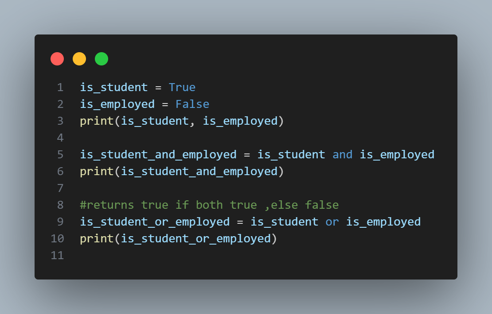
  ###Example Output:
  - True False
  - False
  - True

- *b) Numbers.py*  
  Example of True/False values, comparisons, and arithmetic operations.  
  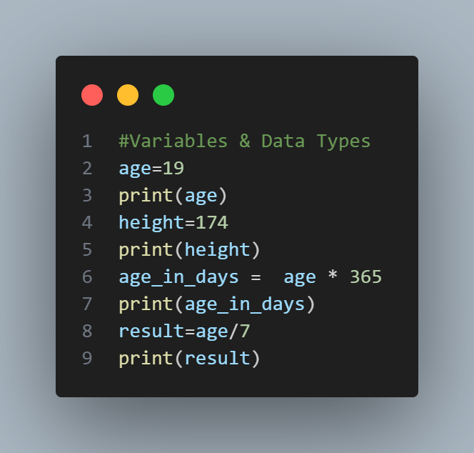
  ###Example Output:
  - 19
  - 174
  - 6935
  - 2.7142857142857144

- *c) String.py*  
  Shows string creation, concatenation, slicing, and basic methods.  
  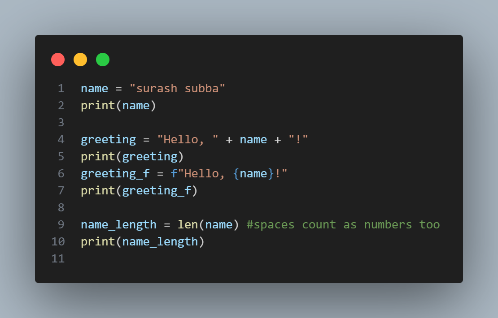
  ###Example Output:
  - surash subba
  - Hello, surash subba!
  - Hello, surash subba!
  - 12

- *d) Type_conversion.py*  
  Demonstrates conversion between data types (e.g., int → str, str → float).  
  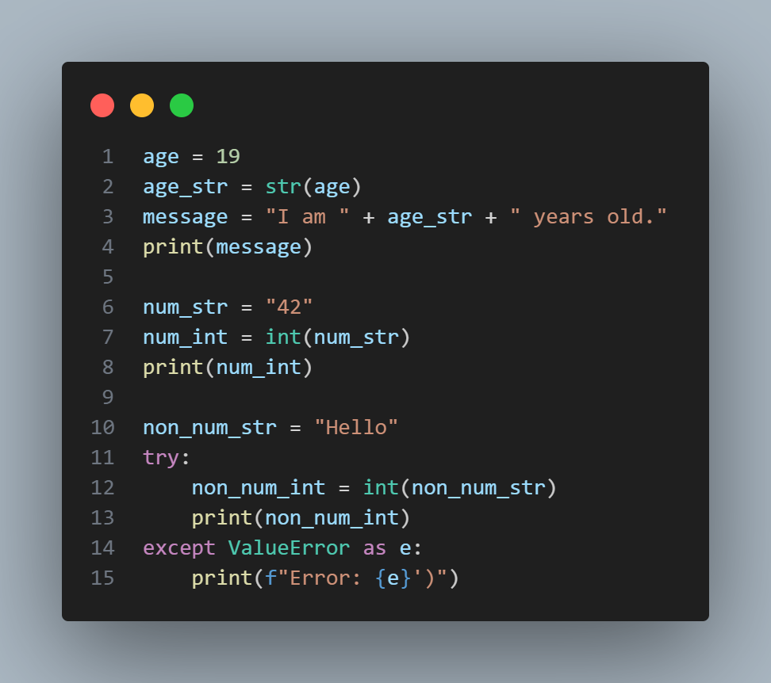
  ###Example Output:
  - I am 19 years old.
  - 42

  ---

##  Learning Outcomes

By completing this practical, I learned:

- How Boolean values and logical operators work.  
- How to use numbers and perform basic operations.  
- String manipulation methods and slicing techniques.  
- Type conversion between different data types.    

---

## (ii)control Structures
- *break_continue*
- *conditionals*
- *loops*

Each file demonstrates a specific concept with examples.

---

##  Files Description

- *a) break-continue.py*  
  Illustrates using break (to exit a loop) and continue (to skip an iteration) to manage loop flow
  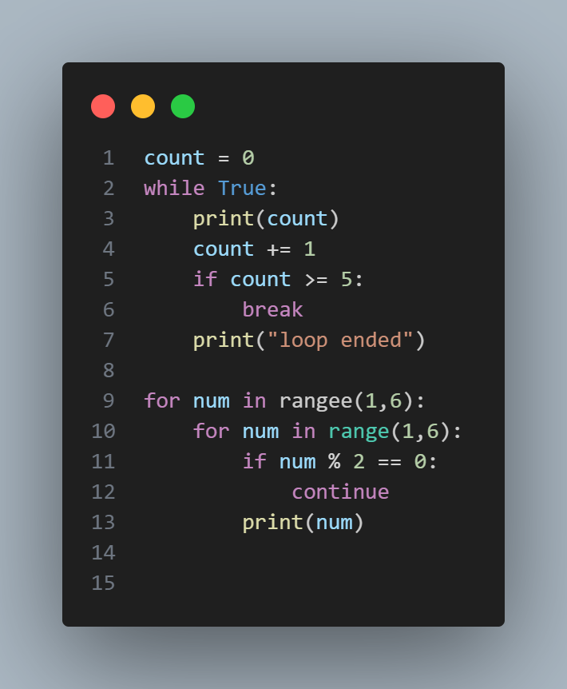
  ###Example Output:
- 0
loop ended
- 1
loop ended
- 2
loop ended
- 3
loop ended
- 4
- 1 3 5 1 3 5 1 3 5 1 3 5 1 3 5

- *b) conditionls.py*  
  Demonstrates the use of if, elif, and else statements for conditional execution. 
  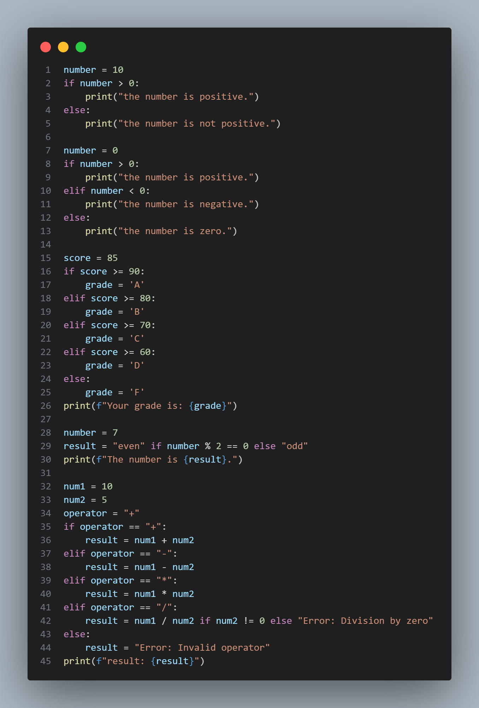
  ###Example Output:
  - the number is positive.
  - the number is zero.
  - Your grade is: B
  - The number is odd.
  - result: 15

- *c) Loops.py*  
  Examples of for and while loops for repetition and iteration. 
  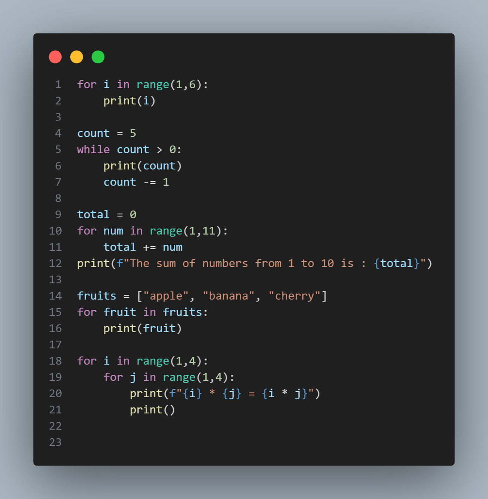
  ###Example Output:
  1
2
3
4
5
5
4
3
2
1
The sum of numbers from 1 to 10 is : 55
apple
banana
cherry
- 1 * 1 = 1

- 1 * 2 = 2

- 1 * 3 = 3

- 2 * 1 = 2

- 2 * 2 = 4

- 2 * 3 = 6

- 3 * 1 = 3

- 3 * 2 = 6

- 3 * 3 = 9
##  Learning Outcomes

By completing this practical, I learned:

- to enable programs to execute specific actions based on data conditions.  
-to automate repetitive tasks and process data collections efficiently.
- to precisely control the internal flow and termination of iterative processes.
---

## (iiI)Data Structures
- *Dictionaries*
- *List*
- *Stack*

Each file demonstrates a specific concept with examples.

---

##  Files Description

- *a) dictionaries.py*  
  Demonstrate creating, accessing, and modifying Python dictionaries. 
  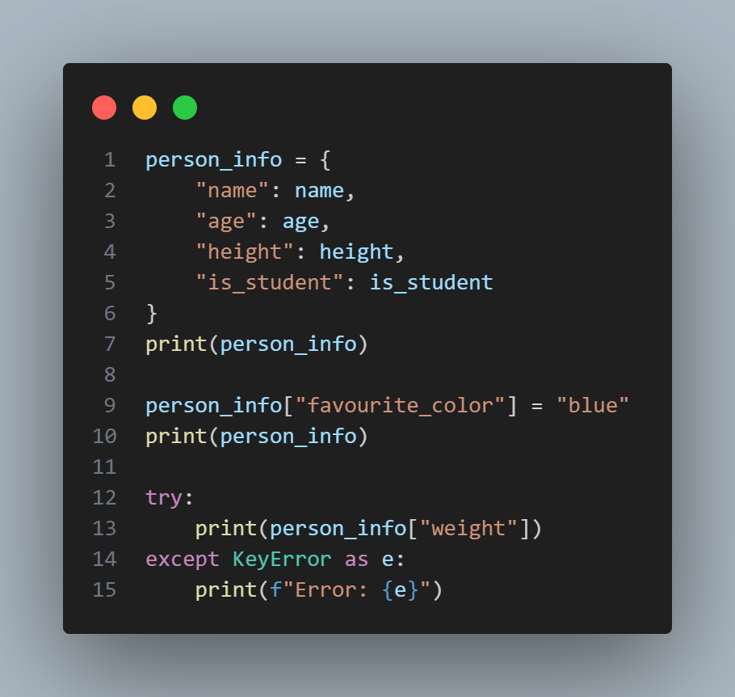
  ###Example Output:
  - {'name': 'surash subba', 'age': 19, 'height': 174, 'is_student': True}
  - {'name': 'surash subba', 'age': 19, 'height': 174, 'is_student': True, 'favourite_color': 'blue'}
  - Error: 'weight'

- *b) list.py*  
  Example of True/False values, comparisons, and arithmetic operations.  
  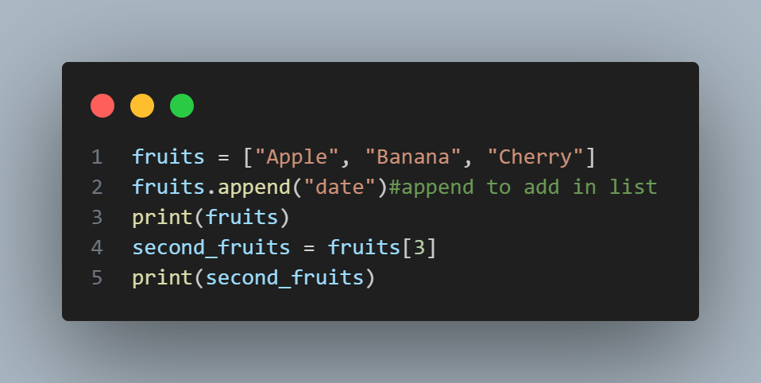
  ###Example Output:
  - ['Apple', 'Banana', 'Cherry', 'date']
  - date

- *c) stack.py*  
  Shows string creation, concatenation, slicing, and basic methods.  
  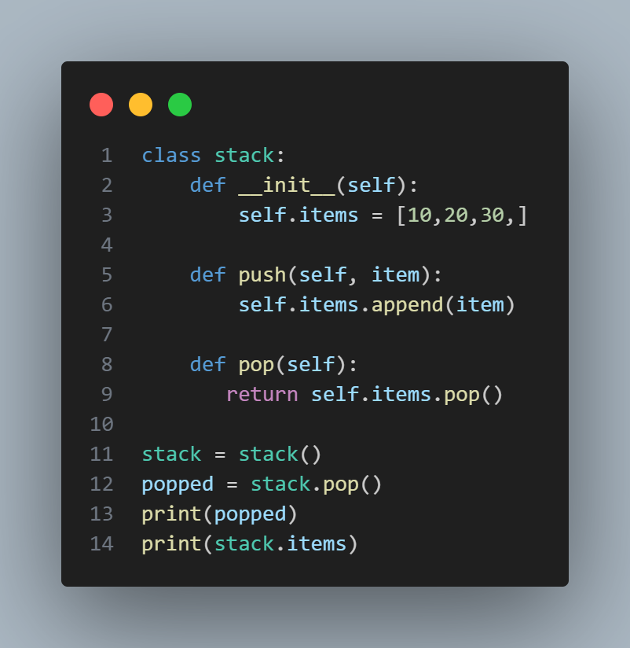
  ###Example Output:
  - 30
  - [10, 20]
  ---

##  Learning Outcomes

By completing this practical, I learned:

- to store and retrive data using key:value pairs  
-  that list is ordered and mutable
- how the **append()** and **pop()** methods are used to stimulate stack and operations
---

## (iv)file_operations
- *binary_files*
- *file_management*
- *text_files*

Each file demonstrates a specific concept with examples.

---

##  Files Description

- *a) binary_files.py*  
Shows how to handle non-textual data by opening files in binary mode and using modules like pickle for object serialization
  
  ###Example Output:
 Binary file created successively.
Binary content: b'\x00\x01\x02\x03\x04\x05'
Bytes appended to binary file.
Binary content: b'\x00\x01\x02\x03\x04\x05\x06\x07\x08\t'

- *b) file_managements.py*  
Contains scripts for system-level operations, such as creating, renaming, and deleting files and directories using the os and shutil modules.
  
  ###Example Output:
  - ['Apple', 'Banana', 'Cherry', 'date']
  - date

- *c) texts files.py*  
  how to read and write human-readable data using the safe with open(...) context manager 
  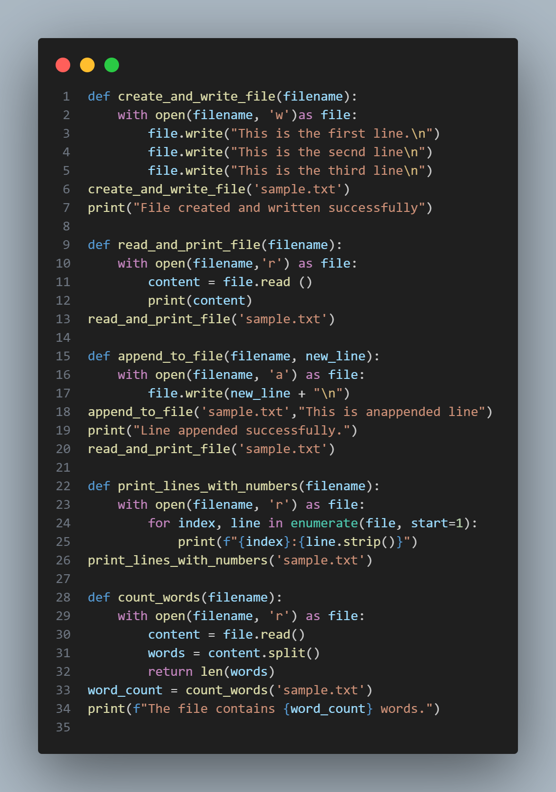
  ###Example Output:
 File created and written successfully
This is the first line.
This is the secnd line
This is the third line

Line appended successfully.
This is the first line.
This is the secnd line
This is the third line
This is anappended line

1:This is the first line.
2:This is the secnd line
3:This is the third line
4:This is anappended line
The file contains 19 words.

##  Learning Outcomes

By completing this practical, I learned:

- Read/Write Data
- understand how to correctly process both text and binary file formats.
- will use Python modules to manage files, including creating, renaming, and deleting them.

## (v) Function and scopes
- *basic function*
- *parameters and return*
- *recursion*
- *scope*

Each file demonstrates a specific concept with examples.

---

##  Files Description

- *a) basics_functions.py*  
Function Definition (def), Calling, Reusability
  
  ###Example Output:
- Hello, World!
- Hello, Alice!
- 25
- True
- False
- 0
- 1
- 2
- 3

- *b) parameters and returns.py*  
Arguments, Parameters, return Value
  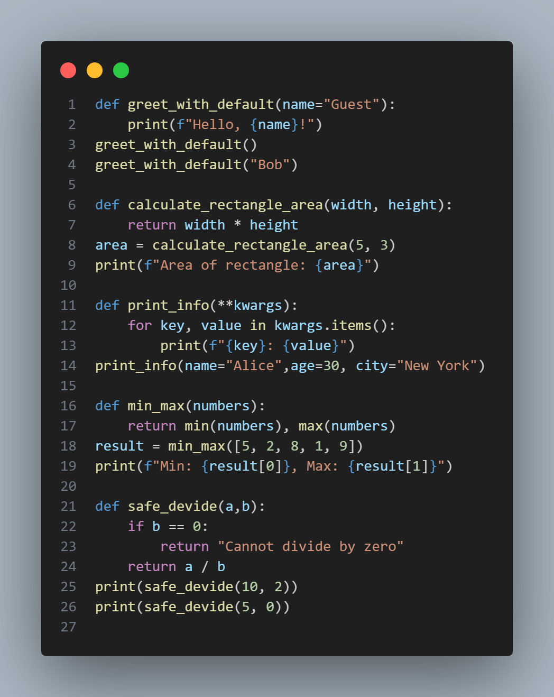
  ###Example Output:
- Hello, Guest!
- Hello, Bob!
- Area of rectangle: 15
- name: Alice
- age: 30
- city: New York
- Min: 1, Max: 9
- 5.0
- Cannot divide by zero

- *c) reccursion.py*  
function calls itself to solve a problem by breaking it down into smaller, similar subproblems (e.g., calculating factorials).
  
  ###Example Output:
120
13

- *d) scope.py*  
Local vs. Global Variables, Variable Visibility
  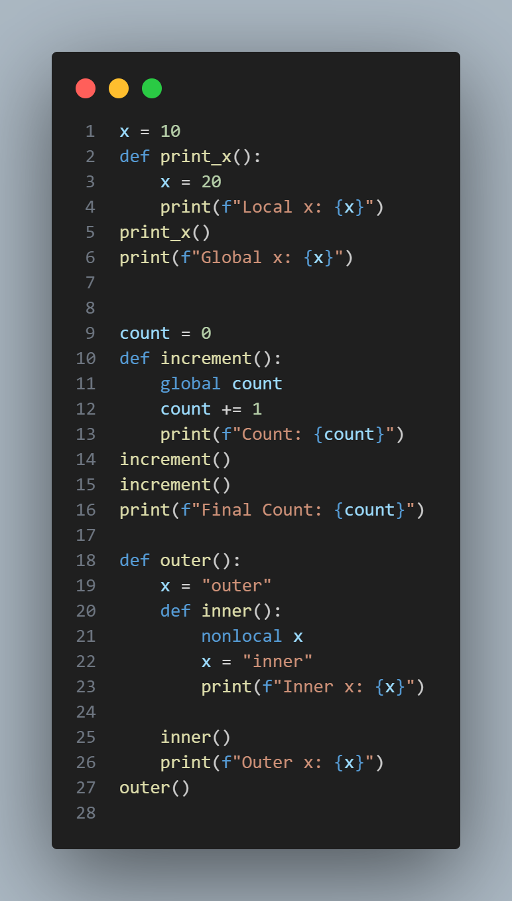
  ###Example Output:
 Local x: 20
Global x: 10
Count: 1
Count: 2
Final Count: 2
Inner x: inner
Outer x: inner

##  Learning Outcomes

By completing this practical, I learned:

- Be able to define and call functions using parameters and returns for modular, reusable code.
- Understand and apply the rules of local and global scope to control variable visibility and prevent naming conflicts.
- Implement recursion to solve problems by defining self-referencing functions.

##Deficulties
- Handling KeyError exceptions when trying to access a key that doesn't exist in a dictionary, requiring use of methods like .get() or in.

##challenges I faced:
errors
- 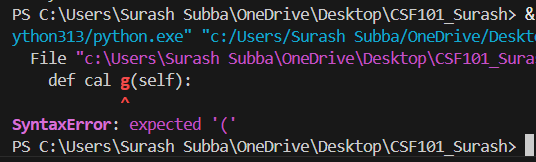
- 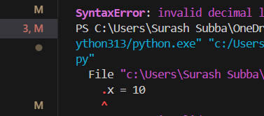
- 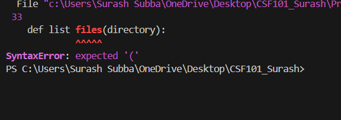
- 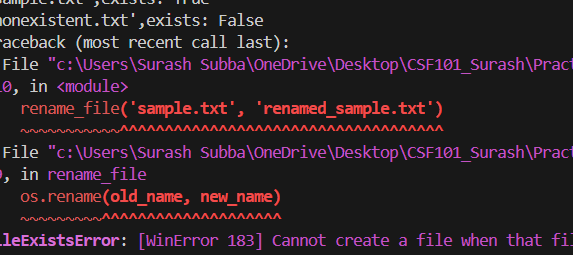

## (v) Operators
- *Arithmatics*
- *assignment*
- *bitwise*
- *comparision*
- *logical*

Each file demonstrates a specific concept with examples.

---

##  Files Description

- *a) Arithmatic.py*  
Used for mathematical calculations.
Examples:
###### + (Addition), - (Subtraction), * (Multiplication), / (Division), % (Modulus)
  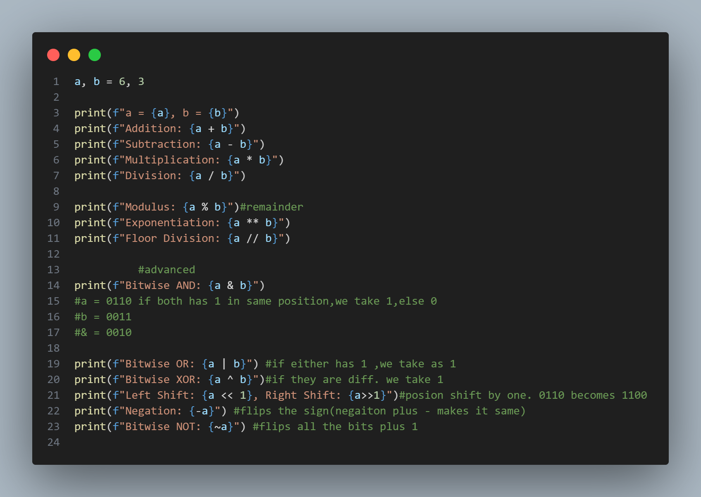
  ###Example Output:
- a = 6, b = 3
- Addition: 9
- Subtraction: 3
- Multiplication: 18
- Division: 2.0
- Modulus: 0
- Exponentiation: 216
- Floor Division: 2
- Bitwise AND: 2
- Bitwise OR: 7
- Bitwise XOR: 5
- Left Shift: 12, Right Shift: 3
- Negation: -6
- Bitwise NOT: -7

 *b) assignment operators.py*  
Used to assign values to variables.
Examples:
= (Assign), +=, -=, *=, /=, %=
  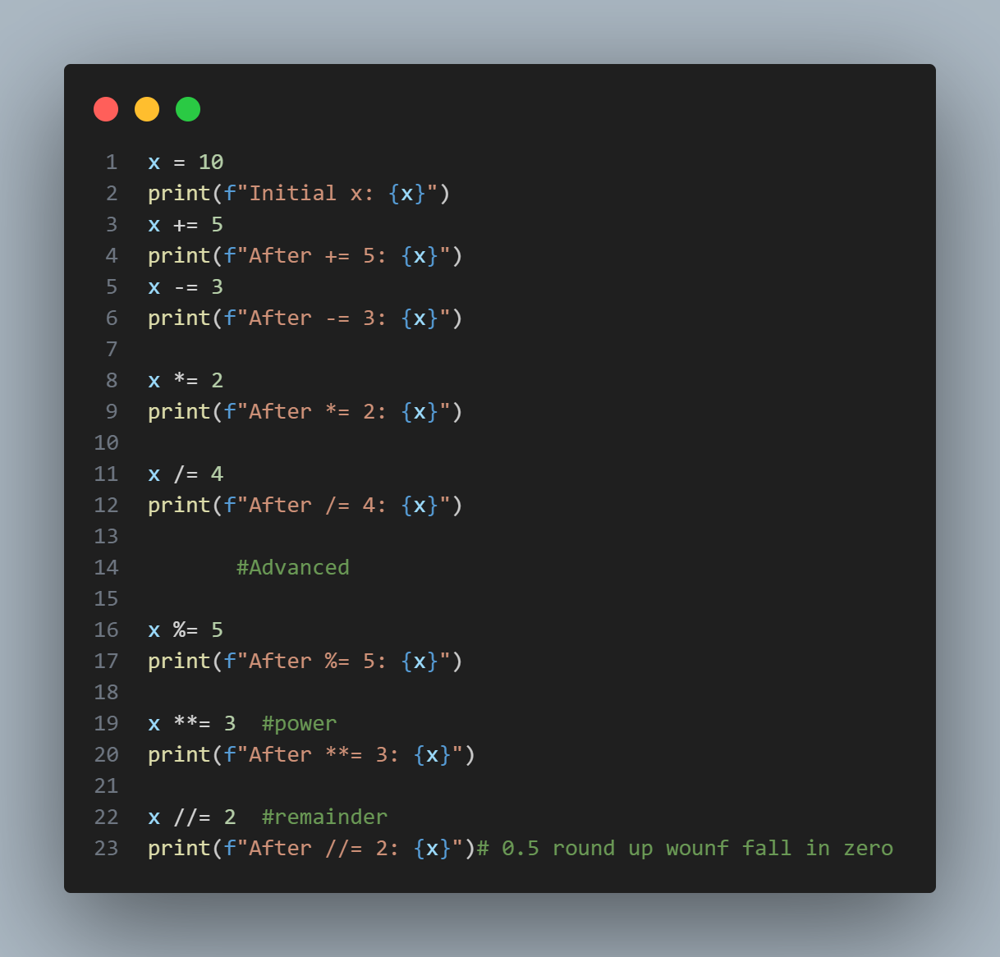
  ###Example Output:
-Initial x: 10
- After += 5: 15
- After -= 3: 12
- After *= 2: 24
- After /= 4: 6.0
- After %= 5: 1.0
- After **= 3: 1.0
- After //= 2: 0.0
- Cannot divide by zero

 *c) Bitwise.py*  
Work on bits (binary values) of numbers.
Examples:
- & (AND), | (OR), ^ (XOR), ~ (NOT), 
- << (Left shift), >> (Right shift)
  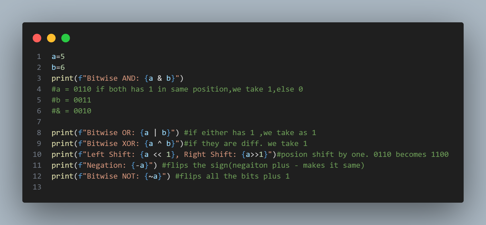
  ###Example Output:
- Bitwise AND: 4
- Bitwise OR: 7
- Bitwise XOR: 3
- Left Shift: 10, Right Shift: 2
- Negation: -5
- Bitwise NOT: -6

*d) comparison.py*  
Used to compare two values.
Examples:
- == (Equal to),
- != (Not equal to),
-  > (Greater than),
-  < (Less than),
- >=, 
- <=
   logical.py*  
Used to combine conditional statements.
Examples:
- and, or, not (in Python)

  ###Example Output:
- x and y: False
- x or y: True
- not x: False
- not y: True
##  Learning Outcomes

By completing this practical, I learned:
- Understand the five main types of - operators in programming.
- Use arithmetic operators to perform basic mathematical operations.
- Apply assignment operators to store and update variable values.
- Use bitwise operators to manipulate data at the binary level.
- Compare values using comparison operators.
- Combine conditions logically using logical operators.

## Floechart_and_pseuducode.(HW)

### Lesson Learned
- how to draw flow chart
- how to write pseudocode and algorithms
- difference between pseudocode and algorithms