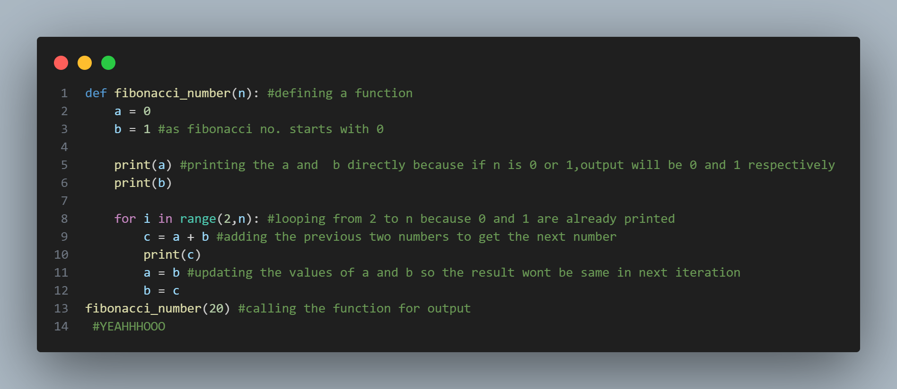

# Practical No. 2

This practical focuses on **Python iteration, control flow, and logical operations**.  
It helps to understand how loops, conditions, and boolean logic work together to control the behavior of programs.

---

## (i) Iteration and Loops

- **File:** `iteration.py`  
- **Concepts Covered:**  
  - Function definition and calling  
  - `for` loop iteration  
  - Fibonacci series generation  
  - Variable updating inside a loop  

### Description:
The program defines a function `fibonacci_number(n)` that prints the first `n` Fibonacci numbers using a `for` loop.  
It starts from 0 and 1, then adds the previous two numbers to get the next one.

### Example Output:
0
1
1
2
3
5
8
13

---

## (ii) Recursion and Function Calls

- **File:** `recursion_factorial.py`  
- **Concepts Covered:**  
  - Function definition and calling  
  - Recursive function logic  
  - Base and recursive cases  
  - Fibonacci series generation using recursion  

### Description:
The program defines a recursive function `fibonacci_number(n)` that prints the Fibonacci sequence by calling itself.  
It uses base cases (`n == 0` and `n == 1`) to stop recursion and returns the sum of the two previous numbers for other cases.

### Example Output:
0  
1  
1  
2  
3  
5  
8  
13  

---

