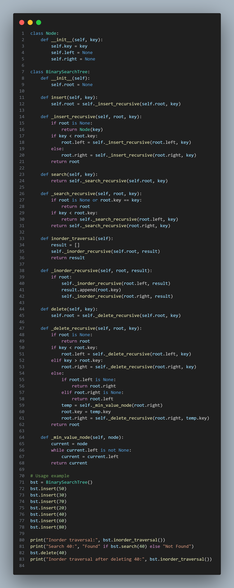

## (v) Binary Search Tree (BST) Operations

- **File:** `bst.py`  
- **Concepts Covered:**  
  - Binary Search Tree (BST) structure  
  - Node creation and linking  
  - Recursive functions for insertion, searching, and deletion  
  - Inorder traversal  
  - Understanding parent-child relationships in a tree  

### Description:
This program demonstrates the creation and manipulation of a **Binary Search Tree (BST)** using Python.  
Each node stores a value (`key`) and has two child references — `left` and `right`.  
The `BinarySearchTree` class provides methods to:
- **Insert** new nodes into the BST  
- **Search** for specific values  
- **Delete** nodes while maintaining BST properties  
- **Display** the tree using inorder traversal  

The BST ensures that all nodes in the left subtree are smaller than the root,  
and all nodes in the right subtree are larger.

### Example Output:
Inorder traversal: [20, 30, 40, 50, 60, 70, 80]
Search 40: Found
Inorder traversal after deleting 40: [20, 30, 50, 60, 70, 80]

### Screenshot:

