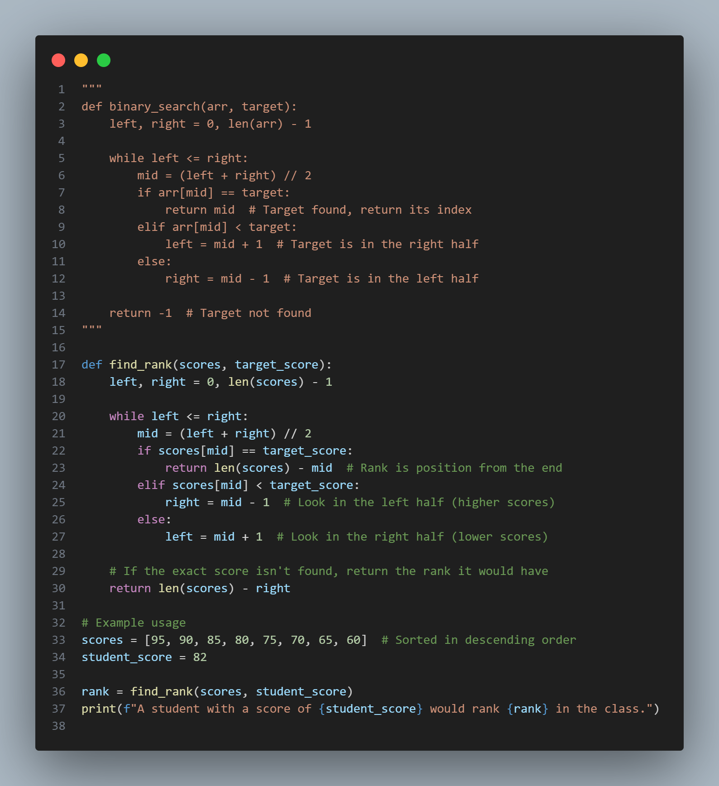
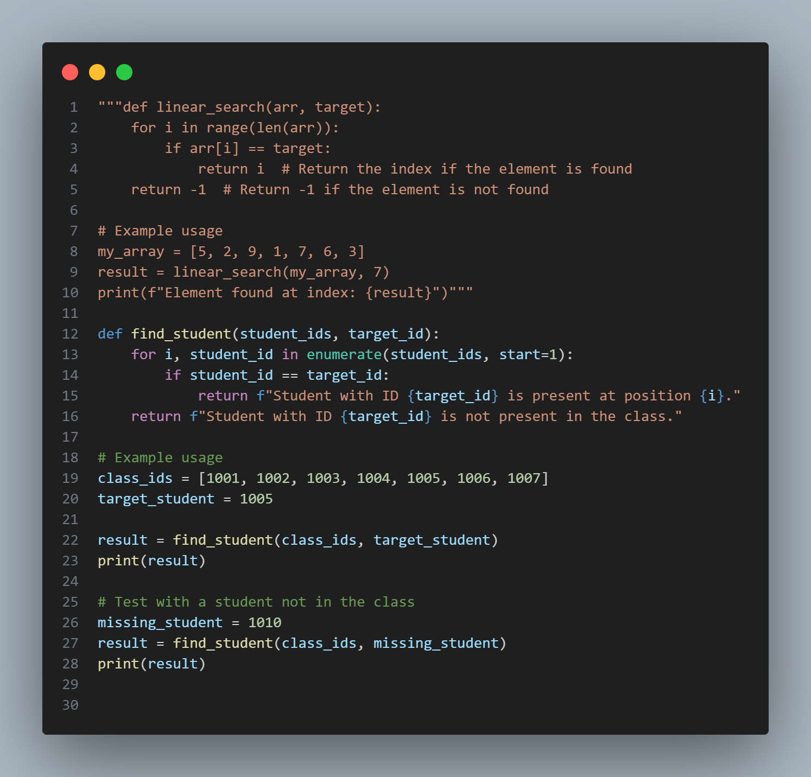

## (vi) Searching Algorithms — Linear Search and Binary Search

- **File:** `search.py`  
- **Concepts Covered:**  
  - Linear Search algorithm  
  - Binary Search algorithm  
  - Iterative searching logic  
  - List traversal and indexing  
  - Applying search for ranking and student ID lookup  

### Description:
This practical demonstrates two common searching techniques used in programming:

1. **Linear Search** — sequentially checks each element in a list until the target is found or the list ends.  
   - Example: Finding a student ID in a class list.  

2. **Binary Search** — repeatedly divides a **sorted** list to locate a target element efficiently.  
   - Example: Finding a student’s rank based on descending score order.

Both examples show how different search algorithms can be used in real-world scenarios,  
such as checking attendance (linear search) and ranking students (binary search).

### Example Output:
A student with a score of 82 would rank 3 in the class.
Student with ID 1005 is present at position 5.
Student with ID 1010 is not present in the class.

### Screenshot:

