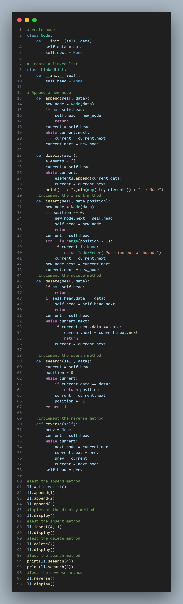

## Reflection — Singly Linked List Operations

### Discuss What I Learned:
- Learned how **nodes** are connected using **pointers** to form a linked list.  
- Understood the difference between **arrays and linked lists** (dynamic vs fixed size).  
- Practiced implementing operations like `append`, `insert`, `delete`, and `reverse`.  
- Gained understanding of **traversing linked structures** using loops.  
- Realized how **class and object** concepts help manage data structures neatly.  

### Challenges Faced and How I Overcame Them:
- **Challenge:** Faced errors when inserting at invalid positions.  
  **Solution:** Used `IndexError` check and handled boundary cases properly.  
- **Challenge:** Reversing the linked list initially misplaced node pointers.  
  **Solution:** Used `prev`, `current`, and `next_node` variables carefully to maintain links.  
- **Challenge:** Typo in search function (`seearch`).  
  **Solution:** Corrected function name and re-tested to ensure functionality.  

### Screenshot:

